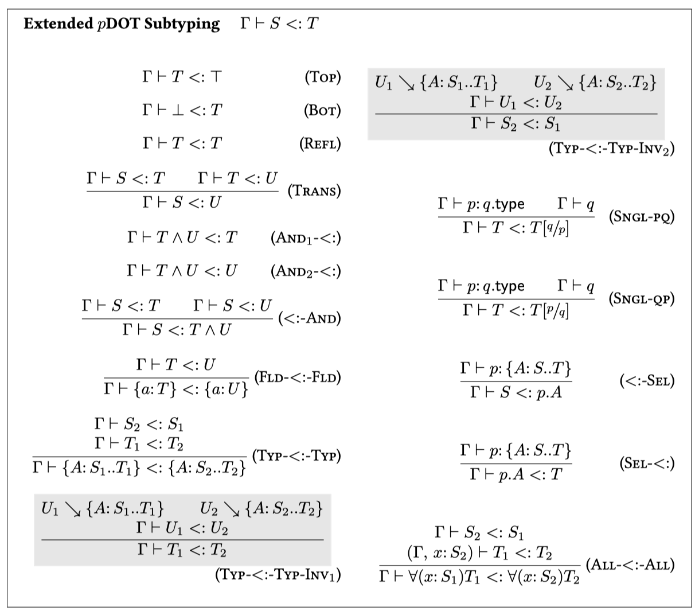

# Soundness Proof for Extended pDOT Calculus

This repository contains type safety proof for the extended pDOT system,
mechanized in Coq.

> The version used to encode the lambda-2Gmu calculus is on the
> [lambda-2Gmu](https://github.com/Linyxus/extended-pdot-calculus/tree/lambda-2Gmu)
> branch.
> The
> [type-case](https://github.com/Linyxus/extended-pdot-calculus/tree/type-case)
> is extended with tags and type cases. (WIP :construction:)

The calculus is extended with the following record subtyping inversion rules,
which will facilitate the formalization of GADT reasoning in pDOT.

```
G ⊢ U1 <: U2
U1 ↘ {A: S1..T1}
U2 ↘ {A: S2..T2}
_________________
G ⊢ S2 <: S1

G ⊢ U1 <: U2
U1 ↘ {A: S1..T1}
U2 ↘ {A: S2..T2}
_________________
G ⊢ T1 <: T2
```

The relation `U ↘ {A: S..T}` states that `U` is an intersection type with all
components being fields, type members or recursive types, the type labels are
unique, and it has the type member `{A: S..T}`.

The proof is modified from [pDOT soundness
proof](https://github.com/amaurremi/dot-calculus/tree/master/src/extensions/paths).

